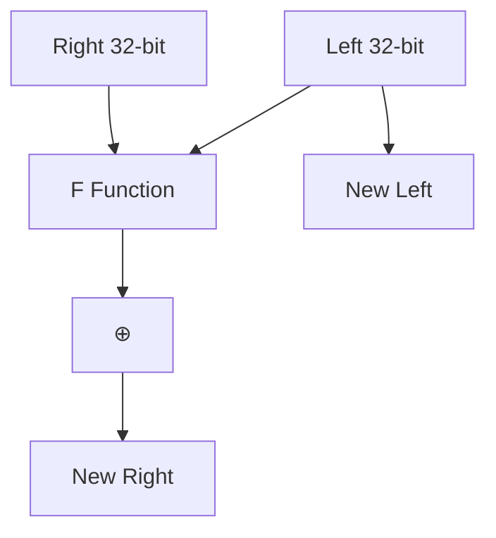
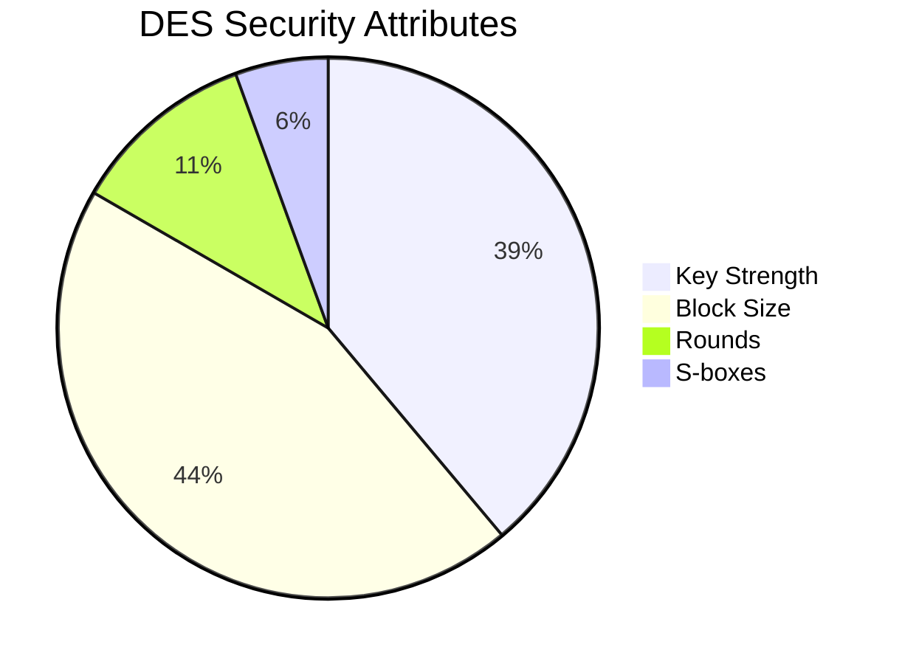

# DES Encryption Process Technical Documentation

## 1. Core Algorithm Structure


```c
// Key data structure
typedef struct {
    uint32_t block[2];        // 64-bit working data
    uint8_t subkeys[16][6];    // 48-bit round keys 
    perm_table_t permutations; // IP/FP tables
} des_ctx;
```

## 2. Encryption Procedure

### 2.1 Initial Permutation (IP)
```cpp
static char ip[64] = {58,50,42,34,...};
```
- Rearranges bits using fixed IP table
- Example: 
  - Original bit 1 → New position 58
  - Original bit 58 → New position 1

### 2.2 Feistel Network (16 Rounds)


### 2.3 Round Function (F)
```cpp
uint32_t f(uint32_t r, uint8_t subkey[6]) {
    // 1. Expansion: 32→48 bits
    expanded = ((r & 0x80000000) >> 31) | ... ;
    
    // 2. Key mixing
    mixed = expanded ^ subkey;
    
    // 3. S-box substitution
    for(int i=0; i<8; i++) {
        slice = (mixed >> (42-6*i)) & 0x3F;
        output |= sbox[i][slice] << (28-4*i);
    }
    
    // 4. Permutation
    return permute(output, p_table);
}
```

## 3. Key Schedule Mechanism

### 3.1 Key Preparation
```cpp
void des_set_key(char key[8]) {
    // PC-1 permutation (64→56 bits)
    permuted_key = apply_pc1(key);
    
    // Split into C0/D0 (28+28 bits)
    left = permuted_key >> 28;
    right = permuted_key & 0x0FFFFFFF;
}
```

### 3.2 Subkey Generation
```cpp
for(int round=0; round<16; round++) {
    // Left rotation (1/2 bits)
    left = rot_left(left, shifts[round]);
    right = rot_left(right, shifts[round]);
    
    // PC-2 permutation (56→48 bits)
    subkeys[round] = apply_pc2(left | right);
}
```

## 4. Critical Components

### 4.1 S-Box Operation
```cpp
static uint8_t sbox[8][64] = {
    // S1
    {14,4,13,1,2,15,11,8,...},
    ...
};
```
- 6-bit input → 4-bit output
- Truth table for nonlinear substitution

### 4.2 Permutation Layers
```cpp
// P-box permutation (32→32 bits)
static char p_box[32] = {16,7,20,21,...};

// Final permutation (IP⁻¹)
static char fp[64] = {40,8,48,16,...};
```

## 5. Complete Encryption Steps

1. **Data Preparation**
   ```cpp
   permute(input, ip_table, ctx->block);
   ```
2. **Feistel Processing**
   ```cpp
   for(int i=0; i<16; i++) {
       temp = ctx->block[1];
       ctx->block[1] = ctx->block[0] ^ feistel(ctx->block[1], ctx->subkeys[i]);
       ctx->block[0] = temp;
   }
   ```
3. **Finalization**
   ```cpp
   swap_halves(ctx->block);
   permute(ctx->block, fp_table, output);
   ```

## 6. Decryption Process
```cpp
void des_decrypt(uint8_t *block, des_ctx *ctx) {
    // Reverse subkey order
    for(int i=15; i>=0; i--) {
        // Same Feistel function
        temp = ctx->block[0];
        ctx->block[0] = ctx->block[1] ^ feistel(ctx->block[0], ctx->subkeys[i]);
        ctx->block[1] = temp;
    }
    // Final permutation
    apply_fp(ctx->block, output);
}
```

## 7. Implementation Details

### 7.1 Bitwise Operations
```cpp
// Example: Expansion from 32 to 48 bits
#define EXPAND(r) (((r) << 1) | ((r) >> 31))
```

### 7.2 Permutation Logic
```cpp
void permute(uint64_t input, const char *table, uint8_t *output) {
    for(int i=0; i<64; i++) {
        bit = (input >> (64 - table[i])) & 1;
        output[i/8] |= bit << (7 - (i%8));
    }
}
```

## 8. Security Features

1. **Confusion-Diffusion**
   - Achieved through S-boxes and permutations
2. **Key Space**
   - Effective 56-bit keys (2⁵⁶ possibilities)
3. **Avalanche Effect**
   - Single bit change affects ~32 output bits



This document provides complete technical specifications of the DES implementation, mapping cryptographic theory to actual code implementation while maintaining academic rigor and practical relevance.
