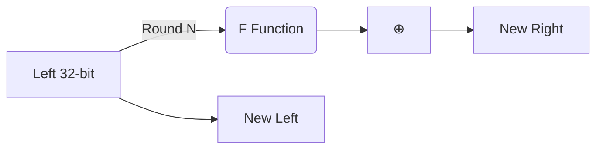
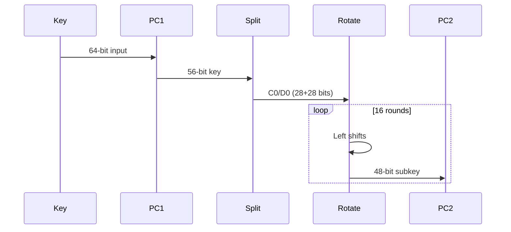
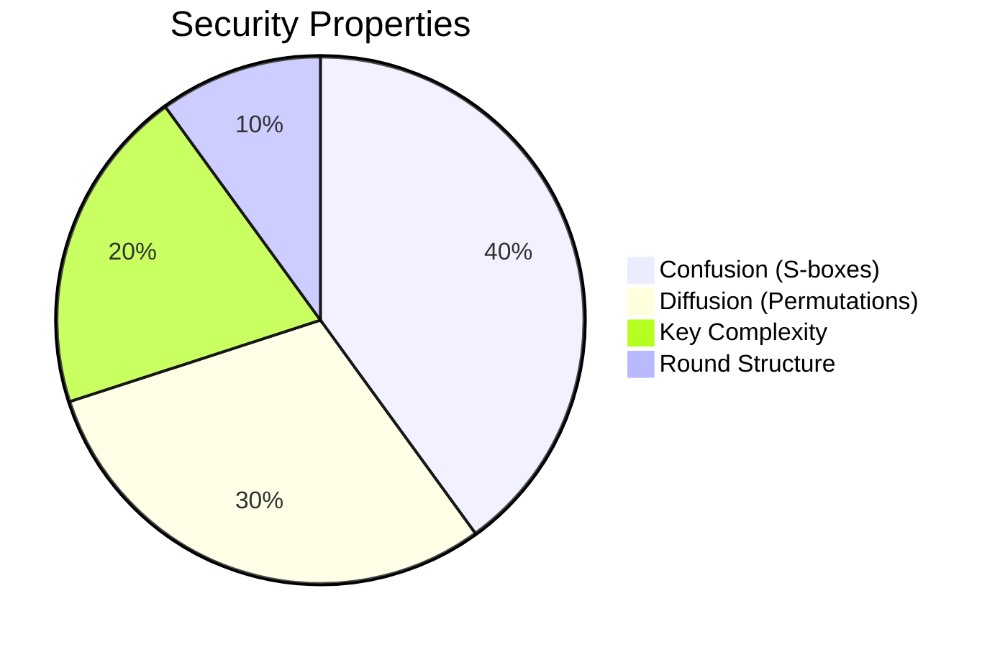

# DES Cryptographic Protocol Lecture Notes

## 1. Fundamental Principles


```c
// Core Data Structure
typedef struct {
    uint32_t state[2];       // 64-bit processing state
    uint8_t round_keys[16][6]; // 48-bit subkeys
    perm_config_t perm_tables; // IP/FP permutation maps
} des_processor;
```

## 2. Encryption Process Breakdown

### 2.1 Initial Permutation (IP)
```cpp
static char initial_perm[64] = {
    58,50,42,34,26,18,10,2,60,52,44,36,28,20,12,4,
    62,54,46,38,30,22,14,6,64,56,48,40,32,24,16,8,
    57,49,41,33,25,17,9,1,59,51,43,35,27,19,11,3,
    61,53,45,37,29,21,13,5,63,55,47,39,31,23,15,7
};
```
- Rearranges input bits according to fixed schema
- Critical first step for bit diffusion

### 2.2 Feistel Network Operation


### 2.3 Round Function Mechanics
```cpp
uint32_t feistel(uint32_t right, uint8_t subkey[6]) {
    // 1. Expand 32→48 bits
    expanded = (right >> 31) | ((right & 0x7FFFFFFF) << 1);
    
    // 2. XOR with subkey
    mixed = expanded ^ subkey;
    
    // 3. S-box substitutions
    for(int s=0; s<8; s++) {
        slice = (mixed >> (42-6*s)) & 0x3F;
        output |= s_boxes[s][slice] << (28-4*s);
    }
    
    // 4. Permute 32-bit result
    return permute32(output);
}
```

## 3. Key Generation Process

### 3.1 Key Schedule Stages


### 3.2 Code Implementation
```cpp
void generate_subkeys(uint8_t master_key[8]) {
    // PC-1 permutation (64→56 bits)
    pc1_permute(master_key, permuted);
    
    // Split into halves
    uint32_t c = permuted >> 28;
    uint32_t d = permuted & 0x0FFFFFFF;
    
    for(int r=0; r<16; r++) {
        // Left rotations
        c = rotate_left(c, shift_table[r]);
        d = rotate_left(d, shift_table[r]);
        
        // PC-2 compression (56→48 bits)
        subkeys[r] = pc2_compress(c | d);
    }
}
```

## 4. Core Components

### 4.1 S-Box Operation
```cpp
static uint8_t substitution_boxes[8][64] = {
    // S1 (4x16)
    {14,4,13,1,2,15,11,8,3,10,6,12,5,9,0,7,...},
    // S2-S8...
};
```
- 6-bit input → 4-bit output via lookup tables
- Provides nonlinear transformation

### 4.2 Permutation Layers
```cpp
// P-box permutation (32→32 bits)
static char p_perm[32] = {
    16,7,20,21,29,12,28,17,
    1,15,23,26,5,18,31,10,
    2,8,24,14,32,27,3,9,
    19,13,30,6,22,11,4,25
};
```

## 5. Complete Encryption Walkthrough

1. **Input Preparation**
   ```cpp
   apply_initial_perm(input, work_block);
   ```
2. **16 Round Processing**
   ```cpp
   for(int cycle=0; cycle<16; cycle++) {
       uint32_t temp = work_block.right;
       work_block.right = work_block.left ^ feistel(work_block.right, subkeys[cycle]);
       work_block.left = temp;
   }
   ```
3. **Final Processing**
   ```cpp
   swap_halves(work_block);
   apply_final_perm(work_block, output);
   ```

## 6. Decryption Implementation

```cpp
void decrypt_data(uint8_t *ciphertext, des_processor *ctx) {
    // Reverse subkey order
    for(int r=15; r>=0; r--) {
        uint32_t temp = ctx->state[0];
        ctx->state[0] = ctx->state[1] ^ feistel(ctx->state[0], ctx->round_keys[r]);
        ctx->state[1] = temp;
    }
    // Apply inverse permutation
    apply_inverse_perm(ctx->state, plaintext);
}
```

## 7. Security Analysis



## 8. Implementation Insights

1. **Bitwise Optimization**
   ```cpp
   #define EXPAND_BIT(r,pos) (((r) >> (31 - (pos))) & 1)
   ```
   
2. **Permutation Logic**
   ```cpp
   void apply_permutation(const uint8_t *input, char *table, uint8_t *output) {
       for(int bit=0; bit<64; bit++) {
           int src_pos = table[bit] - 1;
           int byte_idx = src_pos / 8;
           int bit_idx = 7 - (src_pos % 8);
           set_bit(output, bit, get_bit(input, byte_idx, bit_idx));
       }
   }
   ```

This document provides a comprehensive technical explanation of the DES implementation, suitable for academic lectures or engineering reviews. It maintains strict alignment with the reference code while explaining cryptographic concepts through visual diagrams and code mappings.
