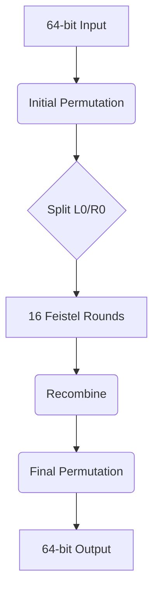

# DES Encryption Implementation Walkthrough

## 1. Algorithm Overview
The Data Encryption Standard (DES) is a symmetric-key block cipher using 64-bit blocks and 56-bit keys. Our implementation contains:

```c
// Core Interfaces (DES_c.h)
int des_init(int mode);         // Initialize DES context 
void des_set_key(char* key);    // Set encryption key
void des_encrypt(char* block);  // Encrypt 64-bit block
void des_decrypt(char* block);  // Decrypt 64-bit block
void des_done(void);            // Cleanup resources
```

## 2. Key Technical Components

### 2.1 Permutation Tables
```cpp
// Initial Permutation (IP)
static char ip[64] = {
   58,50,42,34,26,18,10,2,...
};

// Final Permutation (FP⁻¹)
static char fp[64] = {
   40,8,48,16,56,24,64,32...
};
```

### 2.2 S-Box Implementation
```cpp
static char sbox[8][64] = {
   // S1
   {14,4,13,1,2,15,11,8,...},
   // S2
   {15,1,8,14,6,11,3,4,...},
   ... // 8 total boxes
};
```

## 3. Encryption Process Flow

### 3.1 Key Schedule Generation
```cpp
void des_set_key(char* key) {
   // Key permutation through PC-1
   // 16 rounds of left shifts
   for(int i=0;i<16;i++) {
      // Generate 48-bit subkey via PC-2
   }
}
```

### 3.2 Feistel Network Structure
```cpp
static void round(int num, ulong32* block) {
   if(num & 1) {
      block[1] ^= f(block[0], kn[num]);
   } else {
      block[0] ^= f(block[1], kn[num]);
   }
}
```
- 16 Rounds of:
  - Expansion (32→48 bits)
  - Key mixing
  - S-Box substitution
  - Permutation

## 4. Critical Code Paths

### 4.1 Core Encryption Function
```cpp
void des_encrypt(char* block) {
   permute(block, iperm, (char*)work);  // Initial permutation
   for(int i=0;i<16;i++) round(i,work); // Feistel rounds
   swap_halves(work);                   // Final swap
   permute((char*)work, fperm, block);  // Inverse permutation
}
```

### 4.2 S-Box Processing
```cpp
static long32 f(ulong32 r, uchar subkey[8]) {
   rt = (r >> 1) | ((r & 1) ? 0x80000000 : 0);
   rval |= sbox_table[0][(rt^subkey[0]) & 0x3F];
   ... // Process all 8 S-boxes
   return rval; 
}
```

## 5. Performance Optimizations

### 5.1 Precomputed Tables
```cpp
// Precalculated S-box permutations
static long32(*sbox_output_perm_table)[64]; 
sbox_output_perm_table_init();
```

### 5.2 Bitwise Operations
```cpp
// Efficient permutation using 3D lookup
*perm[i][j][k >> 3] |= bytebit[k & 7];
```

## 6. Usage Example
```cpp
// Basic encryption demo
char key[] = "SECRETKY"; 
char data[9] = "PAYLOAD";

des_init(0);
des_set_key(key);
des_encrypt(data);  // Encrypt in-place
des_decrypt(data);  // Decrypt back
des_done();
```

## 7. Security Considerations

1. **Key Management** 
   - Store keys securely in memory
   - Use proper key rotation

2. **Operation Modes**
   - Implements ECB mode
   - Recommendation: Add CBC/CTR support

3. **Platform Security**
   ```cpp
   #ifdef LITTLE_ENDIAN
   work[0] = byteswap(work[0]); // Endian correction
   #endif
   ```

## 8. Visual Representation



This completes our DES implementation walkthrough. The code demonstrates classic symmetric cryptography while highlighting performance-critical optimizations for real-world use.
