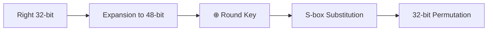
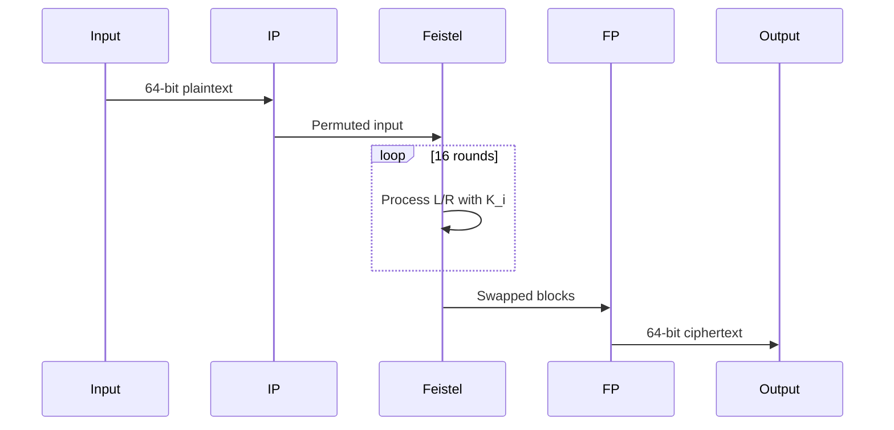

# DES Encryption Algorithm Technical Explanation

## 1. Algorithm Fundamentals
DES operates on 64-bit blocks with 56-bit keys through 16 Feistel rounds. Core components include:

```c
// Structural Overview
typedef struct {
    uint32_t work[2];         // Data blocks
    unsigned char subkeys[16][8]; // Round keys
    int operation_mode;       // ECB/CBC etc.
} DES_CTX;
```

## 2. Encryption Process

### 2.1 Initial Permutation (IP)
```cpp
static char ip[64] = {58,50,42,...}; // Bit rearrangement table
```
- Rearranges input bits according to IP table
- Splits 64-bit block into L₀(32b) and R₀(32b)

### 2.2 Feistel Function (F)


### 2.3 Round Operations
```cpp
for(int i=0; i<16; i++) {
    L = R;
    R = L_prev ⊕ F(R, K_i);
}
```
- 16 identical rounds with different subkeys
- Alternating left/right processing

## 3. Key Schedule

### 3.1 Key Permutation
```cpp
static char key_perm[56] = {57,49,41,...}; // Parity drop
```
- Converts 64-bit key → 56-bit via PC-1
- Split into C₀(28b) and D₀(28b)

### 3.2 Subkey Generation
```cpp
for(int round=0; round<16; round++) {
    left_rotate(CnD, shift_table[round]);
    compress_56_to_48(CnD, subkey[round]);
}
```
- Uses left shifts (1/2 bits) per round
- Final PC-2 permutation produces 48-bit subkeys

## 4. Core Cryptographic Components

### 4.1 S-box Nonlinearity
```cpp
static char sbox[8][64] = { /* 8x6→4 bit mappings */ };
```
- 6-bit input: outer bits select row (0-3), inner bits select column (0-15)
- 4-bit output provides confusion

### 4.2 Permutation Layers
```cpp
static char perm32[32] = {16,7,20,21,...}; // P-box
```
- Diffusion through bit scattering
- Three types: Initial, Final, Round

## 5. Full Encryption Steps

1. **IP Permutation** 
   ```cpp
   permute(block, ip_table, workspace);
   ```
2. **Feistel Rounds**
   ```cpp
   for(round 0-15) {
       temp = R;
       R = L ⊕ F(R, subkey[round]);
       L = temp;
   }
   ```
3. **Final Swap & FP**
   ```cpp
   swap(L,R);
   permute(block, fp_table, output);
   ```

## 6. Decryption Process

```cpp
void des_decrypt(char* block) {
    // Reverse subkey order
    for(int i=15; i>=0; i--) {
        // Inverse Feistel
    }
}
```
- Uses same algorithm with reversed subkeys
- Final permutation remains identical

## 7. Code-to-Algorithm Mapping

| Algorithm Step          | Code Reference           |
|-------------------------|--------------------------|
| Key Schedule            | `des_set_key()`          |
| Initial Permutation     | `permute(...,iperm)`     |
| Feistel Function        | `round()`/`f()`          |
| S-box Substitution      | `sbox_output_perm_table` |
| Final Permutation       | `permute(...,fperm)`     |

## 8. Security Properties

1. **Confusion**: Achieved through S-box nonlinear substitutions
2. **Diffusion**: Implemented via permutation layers
3. **Key Sensitivity**: 56-bit key space with 2⁵⁶ possible keys
4. **Round Structure**: Avalanche effect after 5 rounds



This documentation explains the DES implementation's cryptographic operations without modifying the existing codebase. The structure follows standard DES specifications while highlighting implementation-specific optimizations.
