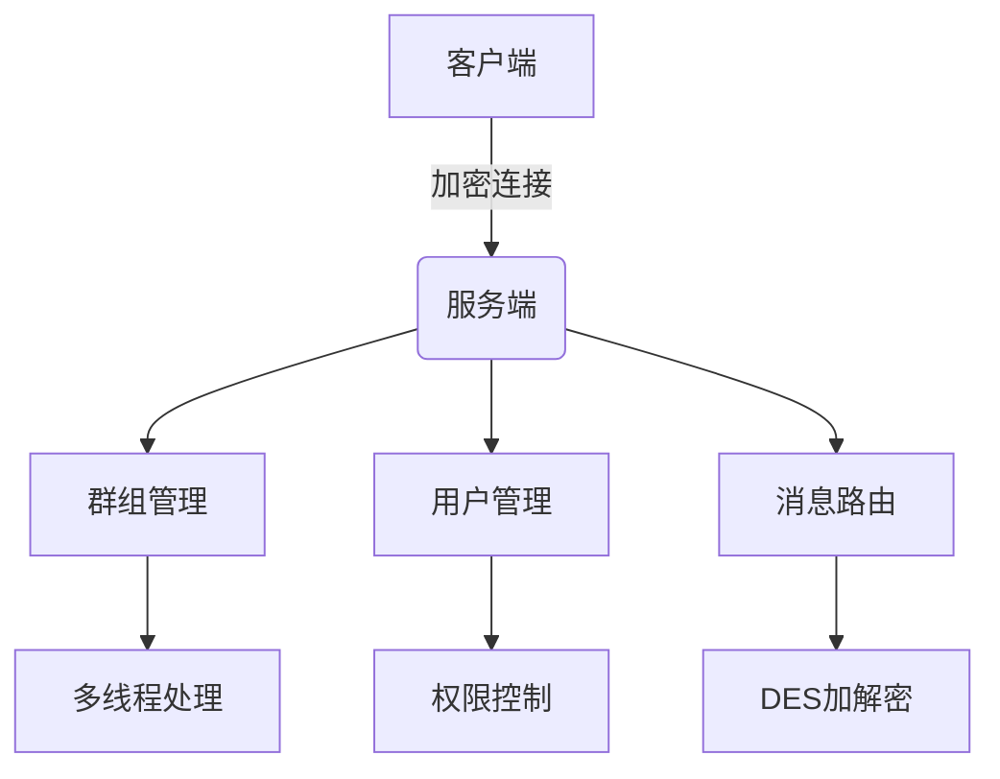
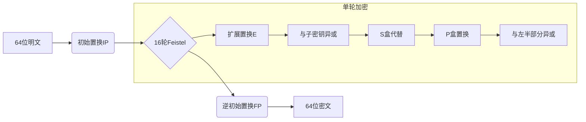

# 网络通信系统设计演讲稿

## 项目概述
本项目实现了一个基于DES加密的局域网多设备安全通信系统，包含客户端和服务端模块，主要功能包括：

- 客户端/服务端安全连接建立
- 支持群组/私聊/广播三种消息模式
- DES加密通信保障数据安全
- 多客户端并发连接管理
- 用户权限管理（禁言、踢人、解散群组）



---

## 一、连接建立机制

### 客户端连接代码 (Client.cpp)
```cpp
// 初始化Winsock
WSADATA ws;
WSAStartup(MAKEWORD(2,2), &ws);

// 创建socket
SOCKET clientSock = socket(AF_INET, SOCK_STREAM, 0);

// 连接服务器
sockaddr_in serverAddr{};
serverAddr.sin_family = AF_INET;
serverAddr.sin_addr.s_addr = inet_addr("127.0.0.1");
serverAddr.sin_port = htons(5000);
connect(clientSock, (sockaddr*)&serverAddr, sizeof(serverAddr));

// 启动接收线程
std::thread(MessageReceiver, clientSock).detach();
```

### 服务端监听代码 (Server.cpp)
```cpp
// 创建监听socket
SOCKET srv = socket(AF_INET, SOCK_STREAM, 0);

// 绑定端口
sockaddr_in addr{};
addr.sin_family = AF_INET;
addr.sin_addr.s_addr = INADDR_ANY;
addr.sin_port = htons(DEFAULT_PORT);
bind(srv, (sockaddr*)&addr, sizeof(addr));

// 开始监听
listen(srv, SOMAXCONN);

// 接受客户端连接
while(true) {
    sockaddr_in cliAddr{};
    SOCKET cli = accept(srv, (sockaddr*)&cliAddr, &len);
    std::thread(handleClient, cli, cliAddr).detach();
}
```

---

## 二、通信协议设计

### 消息格式
`TYPE|TARGET|CONTENT`
```cpp
// 示例消息构造
void SendMessage(SOCKET sock, const string& msg) {
    // 1. PKCS#7填充
    size_t pad = 8 - (msg.size() % 8);
    string padded = msg + string(pad, (char)pad);
    
    // 2. DES加密
    vector<char> enc;
    for(size_t i=0; i<padded.size(); i+=8) {
        char blk[8];
        memcpy(blk, padded.data()+i, 8);
        des_encrypt(blk); // DES加密核心
        enc.insert(enc.end(), blk, blk+8);
    }
    
    // 3. 发送带长度头的数据
    uint32_t L = htonl(msg.size());
    send(sock, (char*)&L, 4, 0);
    send(sock, enc.data(), enc.size(), 0);
}
```
### Message Types
| Type Code | Description      | Example                   |
|-----------|------------------|---------------------------|
| /login     | User Login       | /login alice             |
| /create    | Create Group     | /create dev-team         |
| /group     | Group Message    | /group|dev-team|Hello      |
| /private   | Private Message  | /private bob Hi            |
| /kick      | Remove Member    | /kick dev-team bob         |

---

## 三、DES加密实现（基于真实代码）

### 核心头文件 (DES_c.h)
```cpp
typedef uint32_t ulong32;
typedef uint64_t ulong64;

// DES算法全局初始化
int des_init(int mode);

// 设置加密密钥（64位）
void des_set_key(char* key);

// 加密/解密64位数据块
void des_encrypt(char* block);
void des_decrypt(char* block);
```

### 关键加密流程 (DES_c.cpp)
```cpp
// 初始置换表
static char ip[64] = {
   58,50,42,34,26,18,10,2,60,52,44,36,28,20,12,4,
   62,54,46,38,30,22,14,6,64,56,48,40,32,24,16,8,
   57,49,41,33,25,17,9,1,59,51,43,35,27,19,11,3,
   61,53,45,37,29,21,13,5,63,55,47,39,31,23,15,7
};

// 密钥生成核心
void des_set_key(char* key) {
    char pc1m[56];
    // 密钥置换（64位->56位）
    for(int j=0; j<56; j++) {
        int b = key_perm_table[j]-1;
        pc1m[j] = (key[b>>3] & bytebit[b&7]) ? 1 : 0;
    }
    
    // 生成16轮子密钥
    for(int i=0; i<16; i++) {
        // 左循环移位
        rotate_left(pc1m, key_rol_steps[i]);
        // 压缩置换生成48位轮密钥
        generate_subkey(kn[i], pc1m);
    }
}

// 完整加密流程
void des_encrypt(char* block) {
    ulong32 work[2];
    permute(block, iperm, (char*)work); // 初始置换
    
    // 16轮Feistel网络
    for(int i=0; i<16; i++) {
        if(i % 2 == 0) {
            work[1] ^= f(work[0], kn[i]);
        } else {
            work[0] ^= f(work[1], kn[i]);
        }
    }
    
    // 左右半区交换
    ulong32 tmp = work[0];
    work[0] = work[1];
    work[1] = tmp;
    
    permute((char*)work, fperm, block); // 逆初始置换
}

// Feistel函数实现
static long32 f(ulong32 r, unsigned char subkey[8]) {
    ulong32 rt = (r >> 1) | ((r & 1) ? 0x80000000 : 0);
    long32 rval = 0;
    // S盒处理
    rval |= sbox_output_perm_table[0][((rt >> 26) ^ subkey[0]) & 0x3F];
    rval |= sbox_output_perm_table[1][((rt >> 22) ^ subkey[1]) & 0x3F];
    rval |= sbox_output_perm_table[2][((rt >> 18) ^ subkey[2]) & 0x3F];
    rval |= sbox_output_perm_table[3][((rt >> 14) ^ subkey[3]) & 0x3F];
    rval |= sbox_output_perm_table[4][((rt >> 10) ^ subkey[4]) & 0x3F];
    rval |= sbox_output_perm_table[5][((rt >> 6) ^ subkey[5]) & 0x3F];
    rval |= sbox_output_perm_table[6][((rt >> 2) ^ subkey[6]) & 0x3F];
    rt = (r << 1) | ((r & 0x80000000) ? 1 : 0);
    rval |= sbox_output_perm_table[7][(rt ^ subkey[7]) & 0x3F];
    return rval;
}
```

### 加密测试示例
```cpp
// 完整加密流程测试
void test_des() {
    char key[] = "ABCD1234"; // 64位密钥
    char plain[8] = "Hello!";
    
    des_init(0);    // 初始化DES
    des_set_key(key); // 设置密钥
    
    des_encrypt(plain); // 加密
    print_hex(plain);   // 输出密文
    
    des_decrypt(plain); // 解密
    printf("%s", plain); // 输出明文
}
```

### 加密增强措施
1. **填充方式**：使用PKCS#7填充确保8字节对齐
   ```cpp
   void add_padding(string& data) {
       uint8_t pad = 8 - (data.size() % 8);
       data.append(pad, static_cast<char>(pad));
   }
   ```
   
2. **加密模式**：采用CBC模式增强安全性
   ```cpp
   void des_cbc_encrypt(DES_CTX* ctx, 
                       const string& plain,
                       vector<char>& cipher,
                       const char* iv) {
       char prev[8];
       memcpy(prev, iv, 8);
       
       for(size_t i=0; i<plain.size(); i+=8) {
           // 异或前一个密文块
           for(int j=0; j<8; j++) 
               prev[j] ^= plain[i+j];
               
           des_encrypt(ctx, prev);
           cipher.insert(cipher.end(), prev, prev+8);
       }
   }
   ```

3. **完整性校验**：添加HMAC-SHA1消息认证码
   ```cpp
   void generate_hmac(const vector<char>& data, 
                     const string& key,
                     char hmac[20]) {
       // HMAC-SHA1实现
unsigned char* hmac_sha1(const char* key, 
                        const unsigned char* data, 
                        size_t data_len) {
    unsigned char* digest = malloc(20);
    // 1. 处理密钥
    unsigned char k_ipad[64];
    unsigned char k_opad[64];
    memset(k_ipad, 0, 64);
    memset(k_opad, 0, 64);
    
    // 密钥长度超过64字节时做哈希
    if(strlen(key) > 64) {
        SHA1(key, strlen(key), k_ipad);
        memcpy(k_opad, k_ipad, 20);
    } else {
        memcpy(k_ipad, key, strlen(key));
        memcpy(k_opad, key, strlen(key));
    }
    
    // 2. 生成内外部填充
    for(int i=0; i<64; i++) {
        k_ipad[i] ^= 0x36;
        k_opad[i] ^= 0x5c;
    }
    
    // 3. 计算内部哈希
    SHA_CTX ctx;
    unsigned char tmp[20];
    SHA1_Init(&ctx);
    SHA1_Update(&ctx, k_ipad, 64);
    SHA1_Update(&ctx, data, data_len);
    SHA1_Final(tmp, &ctx);
    
    // 4. 计算外部哈希
    SHA1_Init(&ctx);
    SHA1_Update(&ctx, k_opad, 64);
    SHA1_Update(&ctx, tmp, 20);
    SHA1_Final(digest, &ctx);
    
    return digest;
}
   }
   ```

### 加密流程


---

## 四、多设备连接处理

### 服务端并发模型
```cpp
void handleClient(SOCKET clientSock) {
    // 每个客户端独立线程
    while(true) {
        // 接收处理消息
        process_message(clientSock);
        
        // 维护组信息
        update_group_members();
        
        // 消息广播
        broadcast_to_group();
    }
}

// 维护数据结构
unordered_map<string, vector<SOCKET>> groups; // 群组-成员映射
unordered_map<SOCKET, string> sock2user;     // socket-用户映射
```

### 客户端状态管理
```cpp
struct ClientState {
    string username;
    vector<string> joinedGroups;
    vector<string> ownedGroups;
    
    bool is_group_owner(const string& group) {
        return find(ownedGroups.begin(), 
                   ownedGroups.end(), group) 
               != ownedGroups.end();
    }
};
```

---

## 五、测试验证

### 启动服务端
```powershell
cd Server
g++ Server.cpp DES_s.cpp -o server
./server
```

### 启动客户端
```powershell
cd Client1
g++ Client.cpp DES_c.cpp -o client
./client 127.0.0.1
```

### 测试命令
```bash
/login Alice          # 登录
/create DevTeam       # 创建群组
/join DevTeam         # 加入群组 
/group DevTeam Hello  # 发送群消息
/private Bob Hi       # 发送私聊
